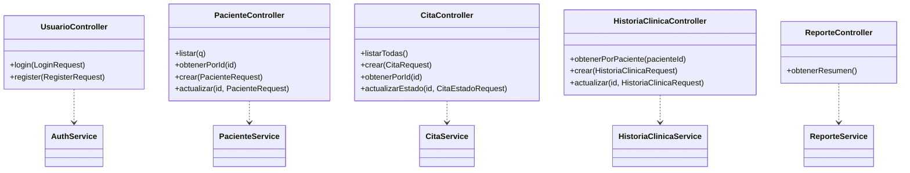
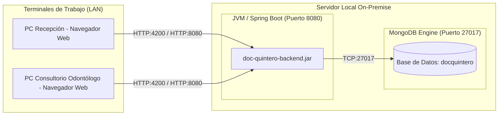

# Diagramas de Arquitectura y Diseño (Modelo C4 y UML)
## Consultorio Odontológico Doc Quintero

---

### 1. Diagrama de Arquitectura de Capas (N-Tier)

```mermaid
graph TD
    subgraph Capa_Presentacion ["Capa de Presentación (Frontend)"]
        UI[Angular 21 + TypeScript]
        AuthMod[Módulo Auth]
        PacMod[Módulo Pacientes]
        CitMod[Módulo Citas & Agenda]
        HcMod[Módulo Historia Clínica]
        RepMod[Módulo Reportes]
    end

    subgraph Capa_Logica ["Capa de Lógica de Negocio (Backend)"]
        Sec[Spring Security + JWT Filter]
        Controllers[Controladores REST]
        Services[Servicios de Negocio]
        Listeners[MongoCsfleEventListener (Cifrado CSFLE)]
    end

    subgraph Capa_Datos ["Capa de Persistencia y Datos"]
        Repo[Spring Data Repositories]
        MongoDB[(MongoDB On-Premise)]
    end

    UI -->|HTTPS / REST JSON| Sec
    Sec --> Controllers
    Controllers --> Services
    Services --> Listeners
    Services --> Repo
    Repo --> MongoDB
```

---

### 2. Diagrama de Componentes del Sistema



---

### 3. Diagrama de Despliegue Local (On-Premise)


