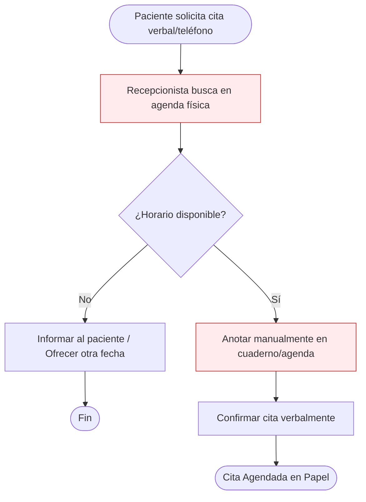
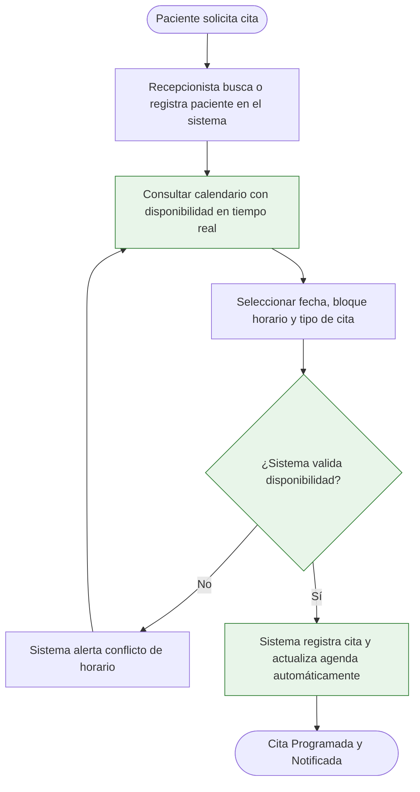
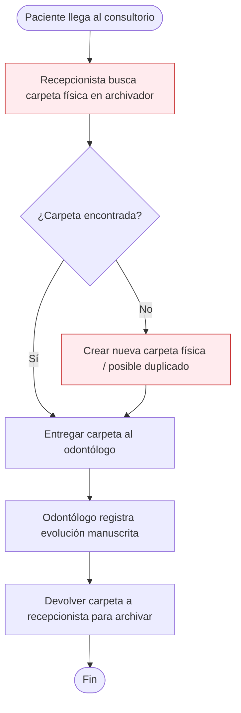
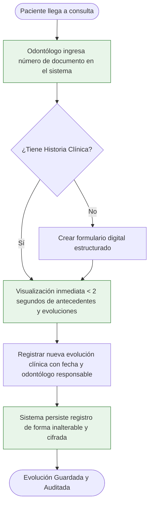

# Diagramas de Proceso (BPMN 2.0 AS-IS y TO-BE)
## Consultorio Odontológico Doc Quintero

En esta sección se sintetiza la evolución de los procesos de negocio descritos y modelados en la tesis de grado:

---

### 1. Proceso de Agendamiento de Citas

#### Estado Actual (AS-IS) - Proceso Manual

*Puntos de falla identificados:* Doble agendamiento por error visual, falta de trazabilidad, pérdida física de la agenda, ausencia de recordatorios automáticos.

#### Estado Futuro (TO-BE) - Sistematizado

---

### 2. Proceso de Gestión de Historia Clínica

#### Estado Actual (AS-IS) - Búsqueda Manual

*Puntos de falla identificados:* Latencia prolongada en búsqueda física, deterioro del papel, mala caligrafía, riesgo de pérdida de información y violación de confidencialidad.

#### Estado Futuro (TO-BE) - Historia Clínica Electrónica

